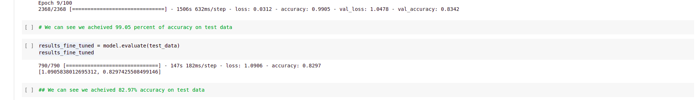
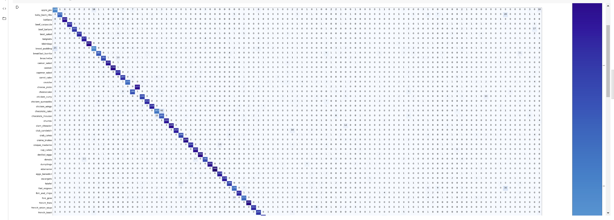
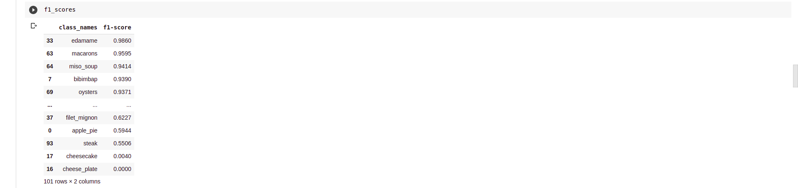
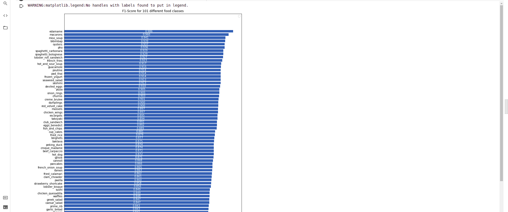
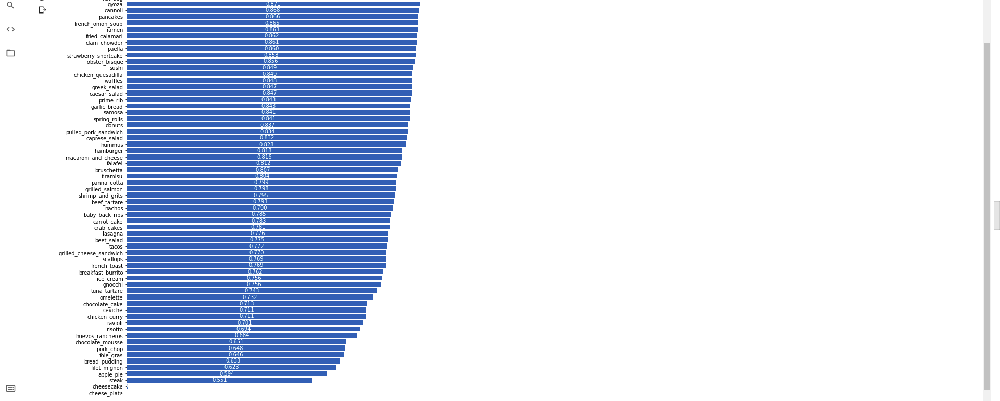
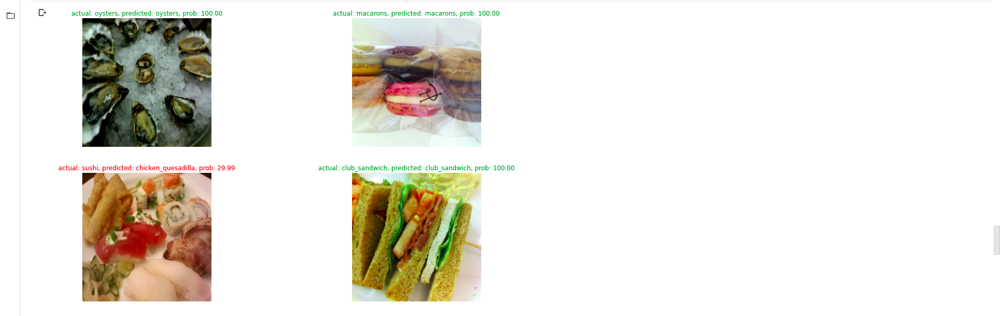
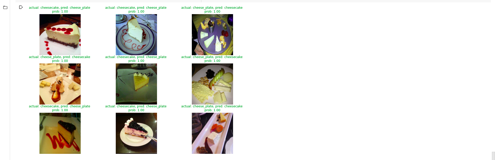
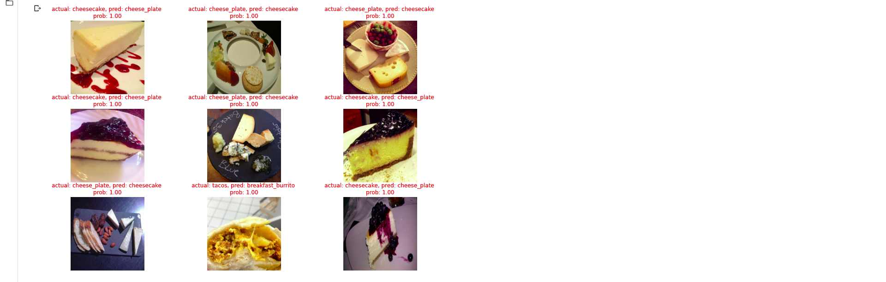

# Food101-tensorflow
* In thes project, a deep neural network was trained for classifying 101 different food types, the dataset used was food101.
* EffiecientNetB7 was used as a base model, which was fine tuned to get acheive higher accuracy.
* Mixed precision was used to reduce computatioin time.
* After four hours of training 82.97 percent of accuracy was achieved on the validation data.
## Output Screenshots:
* Results of training the model
  
* Plotting the confusion matrix on predictions on validation data
  
* Finding the F1-scores for each class
  
* Plotting the F1-score on predictions for each class
  
  
* Predictions on random images with their prediction probability
  
* Predictions on images with most wrong predictions
  
  
